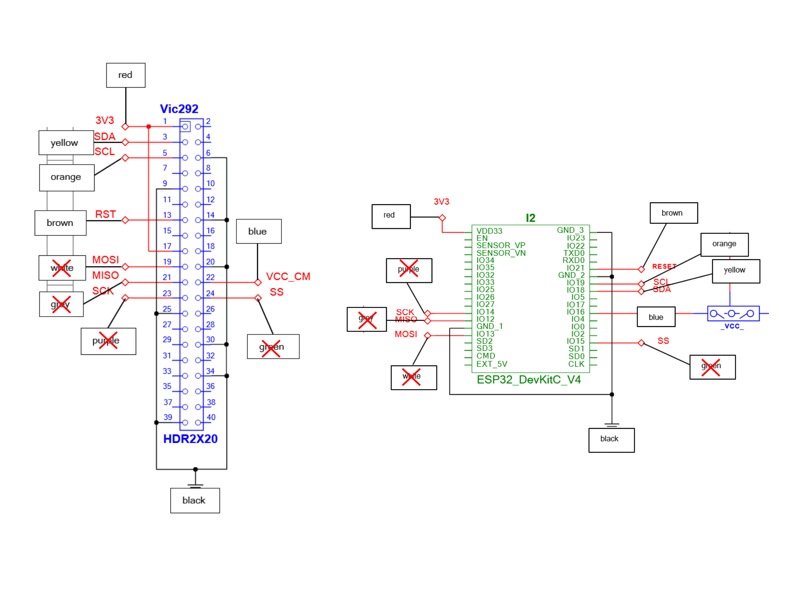
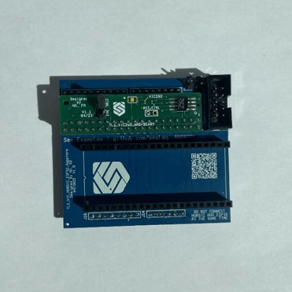
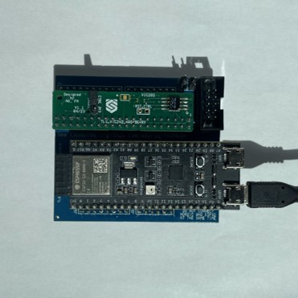
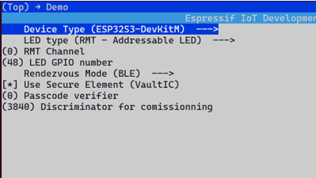
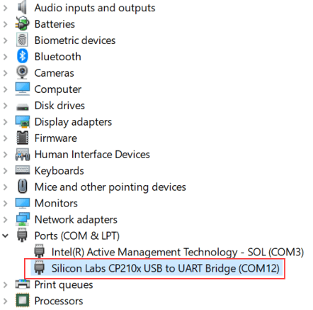
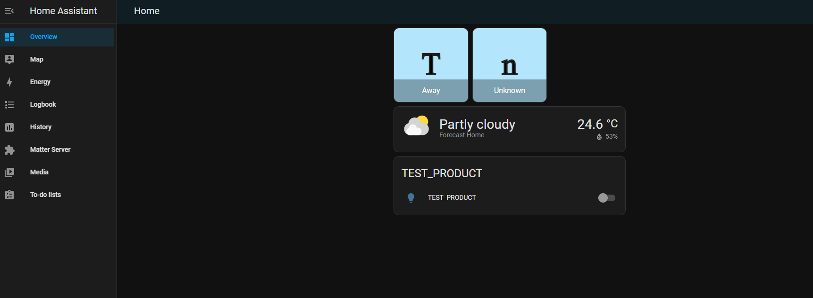
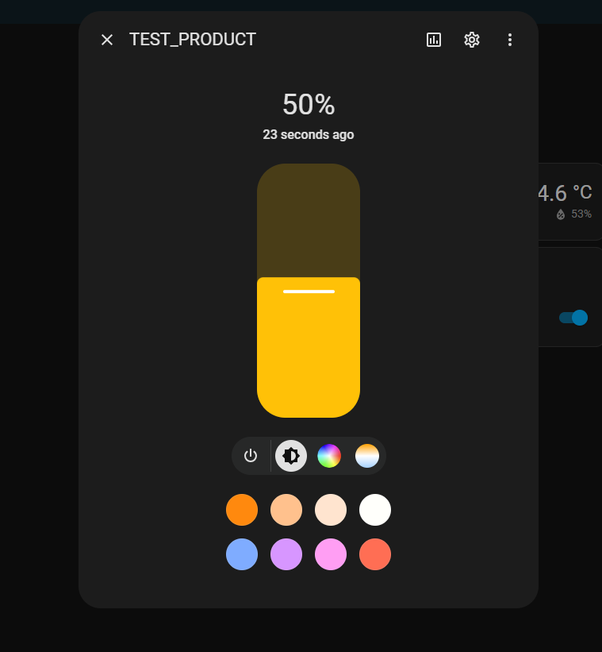

# MATTER DEMO SEALSQ VIC292 ESP32

## Table of Contents

- [MATTER DEMO SEALSQ VIC292 ESP32](#matter-demo-sealsq-vic292-esp32)
  - [Table of Contents](#table-of-contents)
  - [Prerequisites](#prerequisites)
    - [Setup Linux environnement](#setup-linux-environnement)
    - [Connections Esp32-Vic292](#connections-esp32-vic292)
  - [Prepare for build](#prepare-for-build)
    - [Set your esp32 board](#set-your-esp32-board)
    - [Configure credentials in menuconfig](#configure-credentials-in-menuconfig)
    - [Build and flash and monitor](#build-and-flash-and-monitor)
      - [Find Port Number on Windows](#find-port-number-on-windows)
      - [Find Port Number on Linux](#find-port-number-on-linux)
  - [Using demo](#using-demo)
    - [Commissioning with chip-tool](#commissioning-with-chip-tool)
    - [Commissioning with Home Assistant](#commissioning-with-home-assistant)

## Prerequisites

-   Linux VM or
    [WSL for Windows machine](https://learn.microsoft.com/en-us/windows/wsl/install)
-   [esp-idf v5.3](https://github.com/espressif/esp-idf/tree/v5.3) and follow
    this instructions for setup :
    [Setup esp-idf](https://docs.espressif.com/projects/esp-idf/en/stable/esp32/get-started/linux-macos-setup.html)
-   esp32 board
-   access to https://git.sealsq.com/elib/sealsq-elib-292 (please ask sales@sealsq.com)

This demo was tested with
[ESP32-S3-DevKitM-1](https://docs.espressif.com/projects/esp-idf/en/stable/esp32s3/hw-reference/esp32s3/user-guide-devkitm-1.html)
board.

### Setup Linux environnement

Install somes dependencies for connectedhomeip:

```
sudo apt-get install git gcc g++ pkg-config libssl-dev libdbus-1-dev \
     libglib2.0-dev libavahi-client-dev ninja-build python3-venv python3-dev \
     python3-pip unzip libgirepository1.0-dev libcairo2-dev libreadline-dev
```

### Connections Esp32-Vic292

 _Shematic connections
esp32 vic292_


 _Pictures esp32 vic292_

## Prepare for build

Import environement from esp-idf:

```
cd esp-idf

source export.sh

cd ../
```

Clone the repos

```
git clone https://github.com/sealsq/connectedhomeip_SEALSQ.git

cd connectedhomeip_SEALSQ

checkout v1.4.0.0_sealsq_v1.1
```

For setup submodules run this following command:

```
./scripts/checkout_submodules.py --shallow --platform esp32 linux sealsq_vaultic_292
```

Setup dev environement (take 10-20minutes):

```
source scripts/activate.sh
```

### Set your esp32 board

Configure demo for lighting-app example. Set target your esp32 board with this
following commands

```
cd examples/lighting-app/wisekey/vic292/esp32/

idf.py set-target esp32s3
```

### Configure credentials in menuconfig

```
idf.py menuconfig
```

Go to 'Demo' menu and setup your passcode and discriminator for commissionning
(default discriminator is set to 3840)  


### Build and flash and monitor

For build, flash and monitor the demo, run this following command

```
idf.py build

idf.py erase-flash (usb port esp32)

idf.py flash -p (usb port esp32) monitor
```

If you are using WSL, use [idfx](https://github.com/abobija/idfx) and use this
commands

```
idfx erase-flash (usb port esp32)

idfx flash (usb port esp32) monitor
```

#### Find Port Number on Windows

1. Open Device Manager, and expand the Ports (COM & LPT) list.
2. Note the COM port number corresponding to Silicon Labs CP210x USB to UART
   Bridge.  
   
3. In this case, the command to run is as follows:

```
idfx flash COM12 monitor
```

#### Find Port Number on Linux

1. Open terminal and type: ls /dev/tty\*.
2. Note the port number listed for /dev/ttyUSB* or /dev/ttyACM*. The port number
   is represented with \* here.
3. Use the listed port as the serial port in MATLAB®. For example: /dev/ttyUSB0.

## Using demo

### Commissioning with chip-tool

On a Raspberry Pi, follow [this instructions](vic292_rpi_matter.md) up to "Build
examples / chip-tool" and run this command:

```
./out/debug/chip-tool pairing ble-wifi 12345 <Your WiFi SSID> <Your WiFi password> <Your Passcode> <Your Discriminator or 3840 by default> --paa-trust-store-path /home/pi/paa_certs
```

### Commissioning with Home Assistant

-   Follow
    [this guide for install Home Assistant Os](https://www.home-assistant.io/installation/raspberrypi)
    on Raspberry Pi.
-   Follow
    [this guide for onboarding Home Assistant](https://www.home-assistant.io/getting-started/onboarding/).
-   Follow
    [this guide for using Matter integration on Home Assistant Os](https://www.home-assistant.io/integrations/matter/).

build flash and monitor the lighting app

On log of your ESP32, find the link that look like and open it in a web browser:

```
https://project-chip.github.io/connectedhomeip/qrcode.html?data=<COMMISIONING-CODE>
```

On you mobile app Home Assistant instance, go to Settings -> Devices & services
Click on + ADD INTEGRATION button Choose Add Matter device -> No. It's new. Then
flash the QR code

Your phone will maybe ask you some autorizations, approuve it

Home Assistant will automatically commisionning your device

After commisioning, you can use RGB Led on esp32s3 board like on/off or color
change command in this menu 


-   [Espressif SDK Matter GitHub](https://github.com/espressif/esp-matter)
