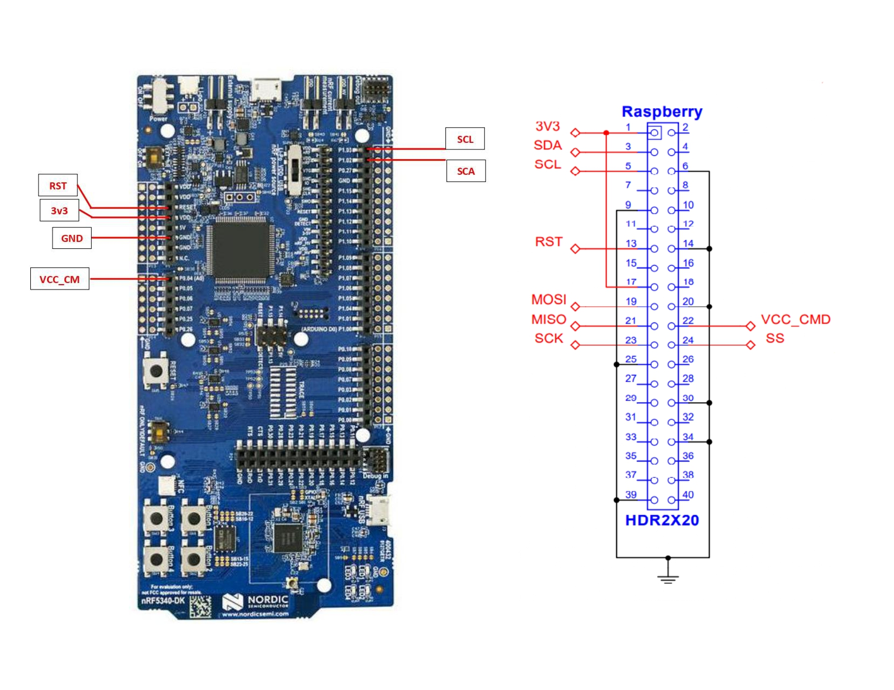
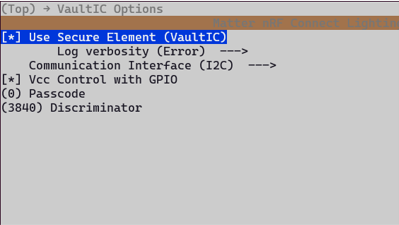
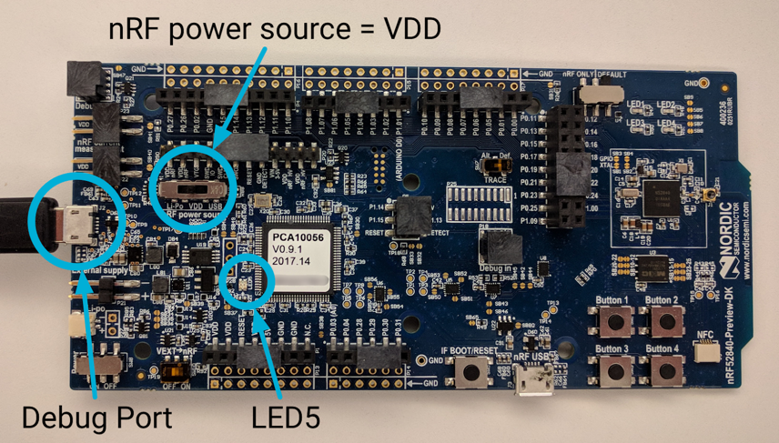
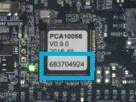
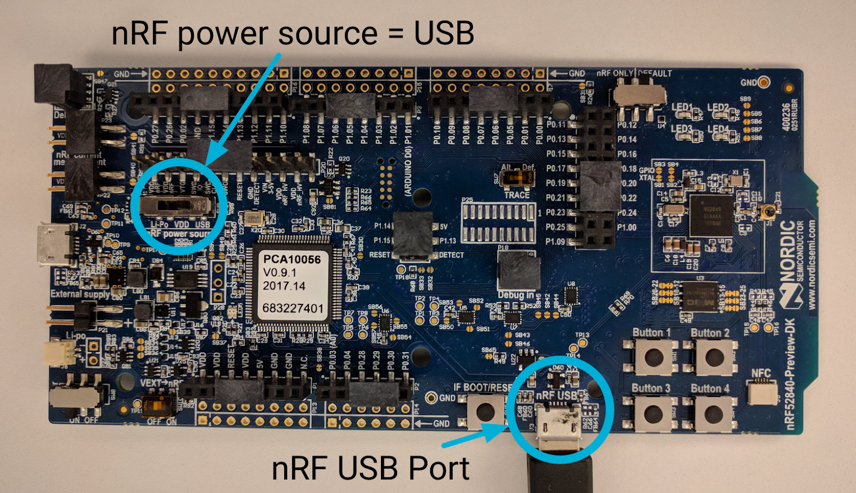
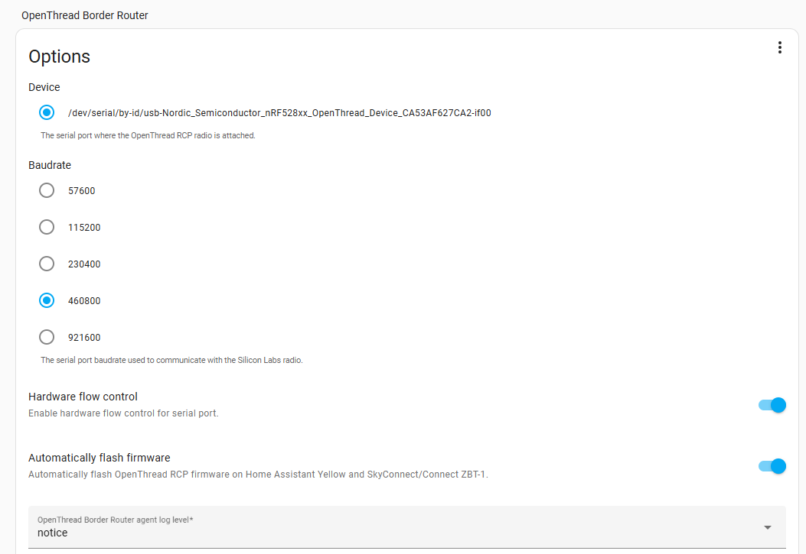
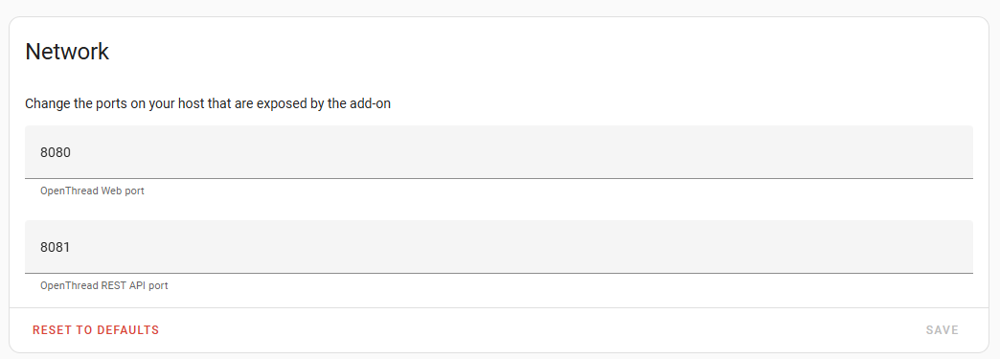
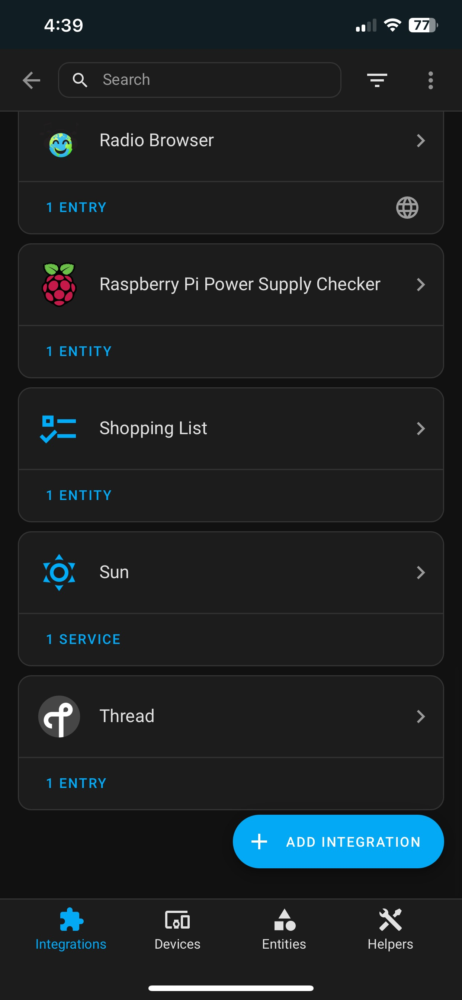
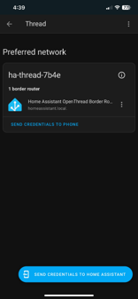

# MATTER DEMO SEALSQ VIC292 NRF CONNECT

## Table of Contents

- [MATTER DEMO SEALSQ VIC292 NRF CONNECT](#matter-demo-sealsq-vic292-nrf-connect)
  - [Table of Contents](#table-of-contents)
  - [Prerequisites](#prerequisites)
    - [Setup Linux environnement](#setup-linux-environnement)
    - [Connections nRF5340dk-Vic292](#connections-nrf5340dk-vic292)
  - [Prepare for build](#prepare-for-build)
    - [Configure credentials in menuconfig](#configure-credentials-in-menuconfig)
    - [Build and flash](#build-and-flash)
  - [Using demo](#using-demo)
    - [Commissioning with chip-tool](#commissioning-with-chip-tool)
    - [Commissioning with Home assistant](#commissioning-with-home-assistant)
      - [Set up the RCP Joiner](#set-up-the-rcp-joiner)
        - [Requierements](#requierements)
        - [Build and flash](#build-and-flash-1)
        - [Connect to native USB](#connect-to-native-usb)
      - [Configuration Home Assistant](#configuration-home-assistant)
      - [Comissionning Matter device](#comissionning-matter-device)
    - [References](#references)

## Prerequisites

-   Linux VM or
    [WSL for Windows machine](https://learn.microsoft.com/en-us/windows/wsl/install)
-   [nRF Connect SDK v2.7.0](https://docs.nordicsemi.com/bundle/ncs-latest/page/nrf/installation/install_ncs.html)
-   [nRF5340dk board](https://www.nordicsemi.com/Products/Development-hardware/nRF5340-DK)
-   access to https://git.sealsq.com/elib/sealsq-elib-292 (please ask sales@sealsq.com)


### Setup Linux environnement

Install somes dependencies for connectedhomeip:

```
sudo apt-get install git gcc g++ pkg-config libssl-dev libdbus-1-dev \
     libglib2.0-dev libavahi-client-dev ninja-build python3-venv python3-dev \
     python3-pip unzip libgirepository1.0-dev libcairo2-dev libreadline-dev
```

### Connections nRF5340dk-Vic292

 _Shematic
connections nRF5340 vic292_

## Prepare for build

Import zephyr environement

```
source ncs/zephyr/zephyr-env.sh
```

Clone the repos

```
git clone https://github.com/sealsq/connectedhomeip_SEALSQ.git

cd connectedhomeip_SEALSQ

checkout v1.4.0.0_sealsq_v1.1
```

For setup submodules run this following command

```
./scripts/checkout_submodules.py --shallow --platform nrfconnect linux sealsq_vaultic_292
```

Setup dev environement (take 5-10minutes):

```
source scripts/activate.sh
```

### Configure credentials in menuconfig

```
cd examples/lighting-app/wisekey/vic292/nrfconnect

nrfutil toolchain-manager launch --ncs-version v2.7.0 --shell

west build -b nrf5340dk_nrf5340_cpuapp --sysbuild -t menuconfig
```

Go to 'VaultIC Options' menu and setup passcode and discriminator (default value
is 3840)  _VaultIC Options menu_

### Build and flash

```
west build -b nrf5340dk_nrf5340_cpuapp --sysbuild
```

For flash the board run this following command

```
west flash --erase
```

If you use Wsl, follow this guide for
[connect USB devices to Wsl](https://learn.microsoft.com/en-us/windows/wsl/connect-usb)

## Using demo

### Commissioning with chip-tool

Fetch and store the current Active Operational Dataset from the Thread Border.
This step may vary depending on the Thread Border Router implementation.

If you are using
[OpenThread Border Router](https://openthread.io/codelabs/openthread-border-router#0)
(OTBR), retrieve this information using one of the following commands:

-   For OTBR running in Docker:

    ```
    sudo docker exec -it otbr sh -c "sudo ot-ctl dataset active -x"
    0e080000000000010000000300001335060004001fffe002084fe76e9a8b5edaf50708fde46f999f0698e20510d47f5027a414ffeebaefa92285cc84fa030f4f70656e5468726561642d653439630102e49c0410b92f8c7fbb4f9f3e08492ee3915fbd2f0c0402a0fff8
    Done
    ```

-   For OTBR native installation:

    ```
    sudo ot-ctl dataset active -x
    0e080000000000010000000300001335060004001fffe002084fe76e9a8b5edaf50708fde46f999f0698e20510d47f5027a414ffeebaefa92285cc84fa030f4f70656e5468726561642d653439630102e49c0410b92f8c7fbb4f9f3e08492ee3915fbd2f0c0402a0fff8
    Done
    ```

For Thread, you might also use a different out-of-band method to fetch the
network credentials.

You can follow this guide for setup
[OpenThread BorderRouteur on a Raspberry Pi](https://openthread.io/codelabs/openthread-border-router#1).

For build chip-tool example run this following command:

```
cd examples/chip-tool

gn gen out

ninja -C out
```

To commission the device to the existing Thread network, use the following
command pattern:

```
./out/chip-tool pairing ble-thread <node_id> hex:<operational_dataset> <pin_code> <discriminator> --paa-trust-store-path <paa_certs_folder>
```

in this command:

-   _<node_id\>_ is the user-defined ID of the node being commissioned.
-   _<operational_dataset\>_ is the Operational Dataset determined previously.
-   _<pin_code>_ and _<discriminator\>_ are device-specific keys determined in
    [setup credential](#configure-credentials-in-menuconfig).
-   _<paa_certs_folder>_ is the folder wich contain your PAA (Product
    Attestation Authority) certificate. For SealSQ PAA certs, localisation is
    "connectedhomeip_SealSQ/examples/platform/wisekey/vic292/paa_certs_SealSQ"

### Commissioning with Home assistant

-   Follow
    [this guide for install Home Assistant Os](https://www.home-assistant.io/installation/raspberrypi)
    on Raspberry Pi.
-   Follow
    [this guide for onboarding Home Assistant](https://www.home-assistant.io/getting-started/onboarding/).
-   [Matter integration on Home Assistant Os](https://www.home-assistant.io/integrations/matter/).
-   [OpenThread BorderRouter add-ons Home Assistant Os](https://www.home-assistant.io/integrations/otbr/).
-   Follow this guide for use
    [nRF52840 board to RCP for openthead border routeur](#set-up-the-rcp-joiner)
    on a RaspberryPi.

#### Set up the RCP Joiner

##### Requierements

-   Install
    [SEGGER J-Link](https://www.segger.com/downloads/jlink/#J-LinkSoftwareAndDocumentationPack)  
    Download the appropriate package for your machine, and install it in the
    proper location. On Linux this is /opt/SEGGER/JLink.
-   Install
    [nRF5x Command Line Tools](https://www.nordicsemi.com/Products/Development-tools/nrf-command-line-tools/download)  
    The nRF5x Command Line Tools allow you to flash the OpenThread binaries to
    the nRF52840 boards. Install the appropriate nRF5x-Command-Line-Tools-<OS>
    build on your Linux machine.
-   Install [ARM GNU Toolchain](https://developer.arm.com/downloads/-/gnu-rm)  
    We recommend placing the extracted archive in
    /opt/gnu-mcu-eclipse/arm-none-eabi-gcc/ on your Linux machine. Follow the
    instructions in the archive's readme.txt file for installation instructions.
-   [Nordic Semiconductor nRF52840 boards](https://www.nordicsemi.com/Products/Development-hardware/nRF52840-DK)

##### Build and flash

For using of nRF52840dk board as RCP, use this command:

```
git clone --recursive https://github.com/openthread/ot-nrf528xx.git

cd ot-nrf528xx

script/build nrf52840 USB_trans -DOT_JOINER=ON -DOT_COMMISSIONER=ON
```

Attach the USB cable to the Micro-USB debug port next to the external power pin
on the nRF52840 board, and then plug it into the Linux machine. Set the nRF
power source switch on the nRF52840 board to VDD. When connected correctly, LED5
is on.



If this is the first board attached to the Linux machine, it appears as serial
port /dev/ttyACM0 (all nRF52840 boards use ttyACM for the serial port
identifier).

```
ls /dev/ttyACM*

/dev/ttyACM0
```

Note the serial number of the nRF52840 board being used for the RCP:  


After connect nrF52840 board to USB to your raspberry pi,Navigate to the
directory with the OpenThread RCP binary, and convert it to hex format and
follow this following command:

Navigate to the directory with the OpenThread RCP binary, and convert it to hex
format:

```
cd build/bin

arm-none-eabi-objcopy -O ihex ot-rcp ot-rcp.hex

nrfjprog -f nrf52 -s (board serial number) --verify --chiperase --program ot-nrf528xx/build/bin/ot-rcp.hex --reset
```

The following output is generated upon success:

```
Parsing hex file.
Erasing user available code and UICR flash areas.
Applying system reset.
Checking that the area to write is not protected.
Programing device.
Applying system reset.
Run.
```

##### Connect to native USB

Because the OpenThread RCP build enables use of native USB CDC ACM as a serial
transport, you must use the nRF USB port on the nRF52840 board to communicate
with the RCP host (Home Assistant).

Detach the Micro-USB end of the USB cable from the debug port of the flashed
nRF52840 board, then reattach it to the Micro-USB nRF USB port next to the RESET
button. Set the nRF power source switch to USB.



Note: When the nRF52840 board is properly connected to a host via the nRF USB
port, none of the LED indicators light up, even though the board is operational.

#### Configuration Home Assistant

Select your RCB board on OpenThread Border Router add ons on home assistant:  


There is also a web interface provided by the OTBR. However, the web interface
has caveats (e.g. forming a network does not generate an off-mesh routable IPv6
prefix which causes changing IPv6 addressing on first add-on restart). It is
still possible to enable the web interface for debugging purpose. Make sure to
expose both the Web UI port and REST API port (the latter needs to be on
port 8081) on the host interface. To do so, click on "Show disabled ports" and
enter a port (e.g. 8080) in the OpenThread Web UI and 8081 in the OpenThread
REST API port field).  


On your Home Assistant app on your phone, go to Settings -> Devices and services
-> Thread -> CONFIGURE and click on "Send credentials to home assistant" and
"Send credential to phone"

{ width=400 height=800 }
{ width=400 height=800 }

Note: you may need to reboot Home Assistant for the changes to apply correctly.

#### Comissionning Matter device

On you mobile app Home Assistant instance, go to Settings -> Devices & services
Click on + ADD INTEGRATION button Choose Add Matter device -> No. It's new. Then
flash the QR code or use NFC

Your phone will maybe ask you some autorizations, approuve it

Home Assistant will automatically commisionning your device

After commisioning, you can on/off LED2 on nrf5340 board


### References

-   [Matter GitHub v1.4.0.0](https://github.com/project-chip/connectedhomeip/tree/v1.4.0.0)
-   [OpenThread Border Router Build and Configuration](https://openthread.io/guides/border-router/build)
-   [Thread Border Router - Bidirectional IPv6 Connectivity and DNS-Based Service Discovery](https://openthread.io/codelabs/openthread-border-router#1)
-   [Build a Thread network with nRF52840 boards and OpenThread](https://openthread.io/codelabs/openthread-hardware#1)
