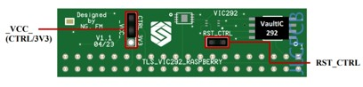
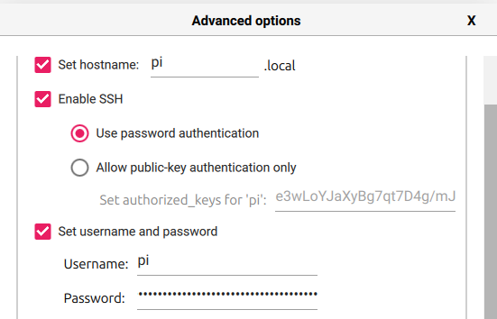

# MATTER DEMO SEALSQ VIC292 RASPBERRY PI

## Table of Contents

- [MATTER DEMO SEALSQ VIC292 RASPBERRY PI](#matter-demo-sealsq-vic292-raspberry-pi)
  - [Table of Contents](#table-of-contents)
  - [Prerequisites](#prerequisites)
    - [Configure the MATTER\_VIC\_2XX\_SOIC\_RASPBERRY BOARD](#configure-the-matter_vic_2xx_soic_raspberry-board)
    - [Setup Raspberry Pi 4](#setup-raspberry-pi-4)
    - [Prepare for build](#prepare-for-build)
  - [Build examples](#build-examples)
    - [Chip-Tool](#chip-tool)
    - [Lighting App](#lighting-app)
    - [Thermostat](#thermostat)
    - [Use examples](#use-examples)
    - [Commissioning with Home Assistant](#commissioning-with-home-assistant)
    - [References](#references)

## Prerequisites

-   Raspberry Pi4 with raspbian buster or bullseye (64 bit required)
-   access to https://git.sealsq.com/elib/sealsq-elib-292 (please ask sales@sealsq.com)

### Configure the MATTER_VIC_2XX_SOIC_RASPBERRY BOARD

Before plugging the board on the Raspberry Pi connector, configure the jumpers:

Set _VCC_ jumper  
 - CTRL | VaultIC power controlled by GPIO25 (default)  
 - 3V3 | VaultIC power always on



### Setup Raspberry Pi 4

Complete the following steps:

1. Using [rpi-imager](https://www.raspberrypi.com/software/) and install
   tRaspberry Pi Os (64-bit) version for boot the SD card (32Go minimum
   required) and log in with the default user account "pi" and password
   "raspberry", check _Enable SSH_ with password authentication:



2. Connect to your RaspBerry Pi via SSH:

```
ssh pi@pi.local
```

3. Install some Raspberry Pi specific dependencies:

```
sudo apt-get update

sudo apt-get install git gcc g++ pkg-config libssl-dev libdbus-1-dev \
 libglib2.0-dev libavahi-client-dev ninja-build python3-venv python3-dev \
 python3-pip unzip libgirepository1.0-dev libcairo2-dev libreadline-dev \
 pi-bluetooth avahi-utils
```

4. Reboot your Raspberry Pi after installing `pi-bluetooth`.

5. Ensure `I2C interface` is enabled on your Raspberry Pi (using raspi-config
   for example)

```
sudo raspi-config
```

Go to "interface Option" -> I2C -> select "YES"

### Prepare for build

To check out the Matter repository and setup submodules, run the following
command:

```
git clone https://github.com/sealsq/connectedhomeip_SEALSQ.git
```

For setup submodules run this following command:

```
cd connectedhomeip

checkout v1.4.0.0_sealsq_v1.1

./scripts/checkout_submodules.py --shallow --platform linux sealsq_vaultic_292
```

Setup dev environement (take 10-20minutes):

```
source scripts/activate.sh
```

If you have an error like

```
cannot import name 'OneStyleAndTextTuple' from 'prompt_toolkit.formatted_text'
```

excute this 2 commands :

```
pip install --upgrade --force-reinstall prompt_toolkit
source scripts/activate.sh
```

## Build examples

### Chip-Tool

For build chip-tool example run this following command:

```
cd examples/chip-tool

gn gen out/debug

ninja -C out/debug
```

### Lighting App

For build lighting-app example run this following command:

```
cd examples/lighting-app/wisekey/vic292/raspberry/

gn gen out/debug

ninja -C out/debug
```

### Thermostat

For build thermostat example run this following command:

```
cd examples/thermostat/wisekey/vic292/raspberry/

gn gen out/debug

ninja -C out/debug
```

### Use examples

Run thermostat example:

```
sudo ./out/debug/thermostat-app --passcode <YourPasscode>
```

Run lighting-app example:

```
sudo ./out/debug/chip-lighting-app --passcode <YourPasscode>
```

The lighting application is now running.

Switch back to another terminal, after run this command:

```
cd connectedhomeip/

source scripts/activate.sh

cd examples/chip-tool/

sudo ./out/debug/chip-tool pairing onnetwork-long 0x11 <YourPasscode> 3840 --paa-trust-store-path ../platform/wisekey/vic292/paa_certs_SealSQ/
```

Command light on:

```
sudo ./out/debug/chip-tool onoff on 0x11 1
```

Command light off:

```
sudo ./out/debug/chip-tool onoff off 0x11 1
```

If needed, device config can be cleared using this following command:

```
sudo rm -rf /tmp/chip_*
```

### Commissioning with Home Assistant

-   Follow
    [this guide for install Home Assistant Os](https://www.home-assistant.io/installation/raspberrypi)
    on Raspberry Pi.
-   Follow
    [this guide for onboarding Home Assistant](https://www.home-assistant.io/getting-started/onboarding/).
-   Follow
    [this guide for using Matter integration on Home Assistant Os](https://www.home-assistant.io/integrations/matter/).

Build flash and monitor the lighting app

On log of your Raspberry lighting app or Thermostat app, find the link that look
like and open it in a web browser:

```
https://project-chip.github.io/connectedhomeip/qrcode.html?data=<COMMISIONING-CODE>
```

On you mobile app Home Assistant instance, go to Settings -> Devices & services
Click on + ADD INTEGRATION button Choose Add Matter device -> No. It's new. Then
flash the QR code

Your phone will maybe ask you some autorizations, approuve it

Home Assistant will automatically commisionning your device

After commisioning, you can use RGB Led on esp32s3 board like on/off or color
change command in this menu 


---

### References

-   [Matter GitHub Master](https://github.com/project-chip/connectedhomeip/tree/master)
-   [Getting started with Matter Arm community](https://community.arm.com/arm-community-blogs/b/internet-of-things-blog/posts/getting-started-with-matter-using-arm-virtual-hardware)
-   [Commissioning operation](https://developers.home.google.com/matter/primer/commissioning)
